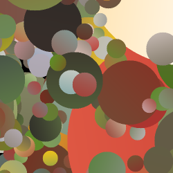

# Dead Leaves++ : Bridging the gap between synthetic and natural images for deep image restoration

|                                                                                    |
| :------------------------------------------------------------------------------------------------------------------: |
| Image denoising comparison of different versions of DRUNet trained on synthetic images vs real-world natural images. |

**Dead Leaves++ : Bridging the gap between synthetic and natural images for deep image restoration**

[Raphael Achddou](https://rachddou.github.io/), [Yann Gousseau](https://perso.telecom-paristech.fr/gousseau/), [Said Ladjal](https://perso.telecom-paristech.fr/ladjal/), [Sabine Susstrunk](https://www.epfl.ch/labs/ivrl/people/susstrunk/)


## Abstract

Even though Deep Neural Networks (NN) are extremely powerful for image restoration tasks, they have several defects. **(1)** they generalize poorly to unseen image modalities, **(2)** they are strongly biased, **(3)** they are hard to interpret. Achddou et al. proposed to address these problems by replacing standard training datasets with synthetic Dead Leaves images, achieving reasonable performance but not nearly as good as the original methods. We identified that this stochastic image model lacked three key properties: geometry, textures, and depth. In this paper, we present the **Dead Leaves++** model which incorporates this properties. Experimental results show that for both Image Denoising and Single-Image Super-Resolution, training state-of-the-art architectures on such images closes the gap from $1.4 \sim 2$dB to $0.5$dB in terms of PSNR, and greatly improves visual quality. We further show that denoisers trained on our synthetic images are more robust to slight distortions. Finally, we carefully analyze which image properties are necessary to achieve good image restoration results.

|    |    |
| :------------------------------------------------------------------------------: | :--------------------------------------------------------------------: |
|                         **Dead Leaves++ examples**                         |                          Dead Leaves examples                          |


## Usage of this repository

The main contribution here corresponds to the data generation code. We also include training and testing code, which was taken from the original repositories of DRUNet and FFDNet. To generate dead leaves images, we first need to install a few python libraries:

```
pip install -r requirements.txt
```
