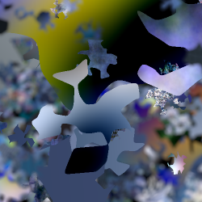

# **VibrantLeaves : A principled parametric image generator for training deep restoration models**

|                                                                                    |
| :------------------------------------------------------------------------------------------------------------------: |
| Image denoising comparison of different versions of DRUNet trained on synthetic images vs real-world natural images. |

**VibrantLeaves : A principled parametric image generator for training deep restoration models**

[Raphael Achddou](https://rachddou.github.io/), [Yann Gousseau](https://perso.telecom-paristech.fr/gousseau/), [Said Ladjal](https://perso.telecom-paristech.fr/ladjal/), [Sabine Susstrunk](https://www.epfl.ch/labs/ivrl/people/susstrunk/)

[](https://arxiv.org/pdf/2504.10201)

## Abstract

Even though Deep Neural Networks (NN) are extremely powerful for image restoration tasks, they have several limitations. They are poorly understood and suffer from strong biases inherited from the training sets. One way to address these shortcomings is to have a better control over the training sets, in particular by using synthetic sets. In this paper, we propose a synthetic image generator relying on a few simple principles. In particular, we focus on geometric modeling, textures, and a simple modeling of image acquisition. These properties, integrated in a classical Dead Leaves model, enable the creation of efficient training sets. Standard image denoising and super-resolution networks can be trained on such datasets, reaching performance almost on par with training on natural image datasets. As a first step towards explainability, we provide a careful analysis of the considered principles, identifying which image properties are necessary to obtain good performances. Besides, such training also yields better robustness to various geometric and radiometric perturbations of the test sets.

|    |    |
| :------------------------------------------------------------------------------: | :--------------------------------------------------------------------: |
|                        **Vibrant Leaves examples**                        |                          Dead Leaves examples                          |

## Usage of this repository

The main contribution here corresponds to the data generation code. We also include training and testing code, which was taken from the original repositories of DRUNet and FFDNet. To generate dead leaves images, we first need to install a few python libraries and create a dictionnary of shapes:

```
sh setup.sh
```

### Data Generation

In order to generate  VibrantLeaves images, run the following command:

```
python image_generation.py
```

This function will generate and store images in the `dataset/vibrantLeaves/` folder. In order to change the parameters of generation feel free to modify the `config/default.yaml` file.

This file is organized as follows:

```
defaults:
  - override hydra/launcher: joblib
shape: ## geometry parameters
  rmin : 20
  rmax : 1000
  alpha: 3.0
  shape_type : "poly"
  multiple_shapes : True

task: 1

texture: ## texture parameters
  texture: True
  texture_types: ["sin","freq_noise","texture_mixes"]
  texture_type_frequency:[0.17,0.67,0.16] #must sum to 1
  texture_gen: True
  warp: True
  rdm_phase: False
  texture_path: ""
  perspective: True

color: ## color parameters
  natural: True
  color_path: "path/to/waterlooDB/"
  grey: False
  partial_images: False

io: ## saving parameters
  path_origin: "datasets/"
  path: "vibrantLeaves/"

post_process: ## depth-of-field and other postprocessing functions
  downscaling: True
  dof: True
  blur_type: "gaussian"
  blur: False

number : 10
size : 1000
image_type : "dead_leaves" 
test: False
```

Hydra allows us to run this code in parralel to save time.

### Datasets

If you don't want to bother with launching data generation, here's a link to dowload the dataset: [UNRELEASED(WIP)]()

### Training

Once the images are generated, you can run the command `.jobs/train.sh`

This will create a directory where the weights are stored inside `TRAINING_LOGS/`

### Testing

#### Denoising

If you just want to test the models you can download the weights on the following [link](https://drive.switch.ch/index.php/s/Bmdq0lOHylwgb9d).

You should also download the [testsets](https://drive.switch.ch/index.php/s/jfh3N5ZNv1KVPpP) and place them in the `datasets/test_sets/` folder.

To test the models, you can run the command `.jobs/test.sh`

This calls the launcher_test.py function with a set of arguments such as the testing dataset and the model to test.

#### Super-resolution

To test the SWIN-IR lightweight super-resolution model, we provide the weights on the following [link](https://drive.switch.ch/index.php/s/uCdAIpnKEfE09xJ).

Please refer to the official implementation for testing/training the models: [swin-IR](https://github.com/JingyunLiang/SwinIR?tab=readme-ov-file).
